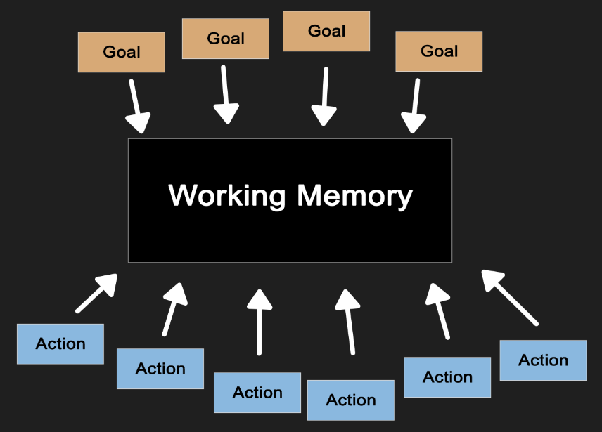
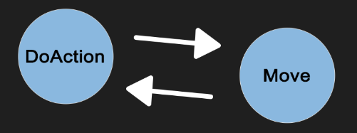

# Goal Oriented Action Planning - Finian Horrie, 2GD10

## What is Goal Oriented Action Planning?

Goal Oriented Action Planning is a form of AI decisionmaking that was developed by Jeff Orkin at M.I.T.

It is an alternative to a Finite State Machine for game AI, and is an attempt to manage complexity in AI behaviours.

Unlike Finite State Machines and Behavior Trees, GOAP decouples actions and goals so they can be used separately in the working memory.

GOAP makes use of planning to allow complex behaviour. 

This makes GOAP slower than equivalent Finite State Machines and Behavior Trees, but more flexible when it comes to adding or removing functionality

# How does it work?

## Actions

Every action in GOAP has a precondition and an effect

In order to perform an action, all preconditions must be met.

When an action is finished, it should have an effect on the world.

The effects of certain actions may validate preconditions for other actions.

This leads to “action chains” in which the AI exhibits smart behaviour.

## Goals

A character gets a goal (or several goals) and knows what actions it can perform.

The goal should resemble an end state for the AI.

A character with no goals will do nothing. We are obliged to assign goals to allow actions to be performed.

In our previous example we had this goal:

## Planning

We can feed our 3 sources of information to the planner in order to figure out a plan:

1. Actions
2. Goals
3. Information on the World State

The planner can then formulate a plan to attempt to achieve our goal.

- Plans may only be executed if every precondition is met.
    - Example: AI can only shoot the target if `TargetVisible == true` , `WeaponLoaded == true` and `IsAlive == true`.
- When a goal is met, the world has to change in some way.
    - Example: AI opens a closed door → `Worldstate.door1 == closed` → `Worldstate.door1 == open`

A plan will always be validated going from back to front to see if it is achievable.

- If an action in the plan gets invalidated due to external input, the plan is discarded and another plan is formulated.

**What if we have 2 valid plans for the same goal?**

- We add a cost per action to find the optimal plan.

The planner can then make use of any node based search algorithm (preferably A*) to find the plan with the lowest cost.

A plan execution is done with a very simple Finite State Machine. (”Move” and “Do action” nodes)

In my implementation, almost all actions work with the "Move" state

---

# Implementation
## GOAP Hospital

For my implementation I made a hospital that has 2 entities which use GOAP for their decisionmaking.

Every instance has a planner to formulate a plan to achieve their respective goals.

Lets go over their behavior:

## Patient

The patient is created outside of the hospital.

His first subgoal is to get to the waiting room ("IsWaiting"). To get there he needs to perform these actions:

- GoToHospital
- Register
- GoToWaitingRoom

Lets see it in action:

https://github.com/Howest-DAE-GD/gpp-researchtopic-FHorrie/assets/119864586/9ebcff79-223c-4e9b-a17c-3a603dd48d89

After the patient arrives in the waiting room, he adds "Waiting" to the world state, which is printed on the top left.

The first nurse reads this information from the world state, which is also their precondition to complete their own goal.

The patient has now completed his first subgoal.

His next subgoal is to get treatment ("IsTreated"). To get there he needs to perform only a single action:

- GetTreated

Seems simple enough, but the patient just waits in the waiting room, what is going on?

Lets see what happens next:

https://github.com/Howest-DAE-GD/gpp-researchtopic-FHorrie/assets/119864586/423fa58d-cfd1-4165-99c4-94f83497f2aa

The patient is in the waiting room untill the nurse gets close enough to start leading him to a cubicle.

- The patient needs to be recovered from the waiting room to proceed with his own actions.
- The nurse recovering him validates a precondition for the "GetTreated" action.
- This happens in the world state, entities cannot directly influence other entities

When the patient is picked up we modify some world states again

- "Waiting" is decremented, because the patient is recovered from the waiting room.
- "FreeCubicle" is decremented, because the patient and the nurse will go there next
- We push a nurse state to world state for visualizing purposes: "TreatingPatient"

After the patient is treated, the patient's last subgoal can be completed:

https://github.com/Howest-DAE-GD/gpp-researchtopic-FHorrie/assets/119864586/f1abd30b-1c50-446e-b0af-4aa8b8a0913e

The last goal is "GoHome" in which the patient makes his way back through the doorway out of the hospital.

In the simulation, "Home" is a place further from the hospital. 

When the patient arrives at "Home" we remove the patient and push the "AtHome" state to world state for visualizing purposes.

## Nurse

The nurse is a bit less complicated. Their main goal is to "TreatPatient", but they also have a "Rested" goal.

These goals are permanent and upon completion cannot be removed. This makes it so the nurse keeps attending to patients.

After some time (10 - 20 sec) the nurse will get the "Exhausted" state. This is a precondition for the "Rest" action.

After completing the "TreatPatient" goal, the nurse will go to rest when they have the "Exhausted" state.

Completing the "Rested" goal removes the "Exhausted" state, allowing it to be added again later

The current action and plan from the first nurse is printed on the top right of the screen

https://github.com/Howest-DAE-GD/gpp-researchtopic-FHorrie/assets/119864586/265dbbc1-9523-486e-926a-ed903857369a

# Conclusion

Looking back on this research project, I am quite satisfied with my findings and results.

Goal Oriented Action Planning presents itself as a great method for creating game based AI. It amazes me how flexible it is, but also saddens me that it's so scarcely used in favor of behaviour trees or finite state machines.

Planners can be very heavy on performance when using many entities, which isn't optimal for AAA games.

# References

- Three States and a Plan, The AI of F.E.A.R. - Jeff Orkin
    - For the insight
    - https://www.gamedevs.org/uploads/three-states-plan-ai-of-fear.pdf
- Building the AI of F.E.A.R. with Goal Oriented Action Planning - AI and Games
    - For the idea
    - https://youtu.be/PaOLBOuyswI?si=eE_awrbfynYCwNvd
- Goal-Oriented Action Planning: Ten Years of AI Programming - Chris Conway (GDC)
    - https://youtu.be/gm7K68663rA?si=aNzHI-vLWokN4LcS
- Holistic3D
    - For the Hospital Unity asset package and practical planner explanation
    - https://holistic3d.com/
 
Special thanks to Mikail Kahya who piqued my interest by showing me the video about GOAP.

Thank you for reading my explanation. I hope you have a great day.
